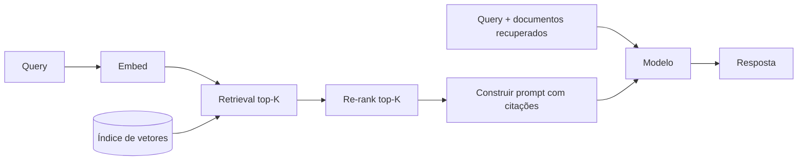
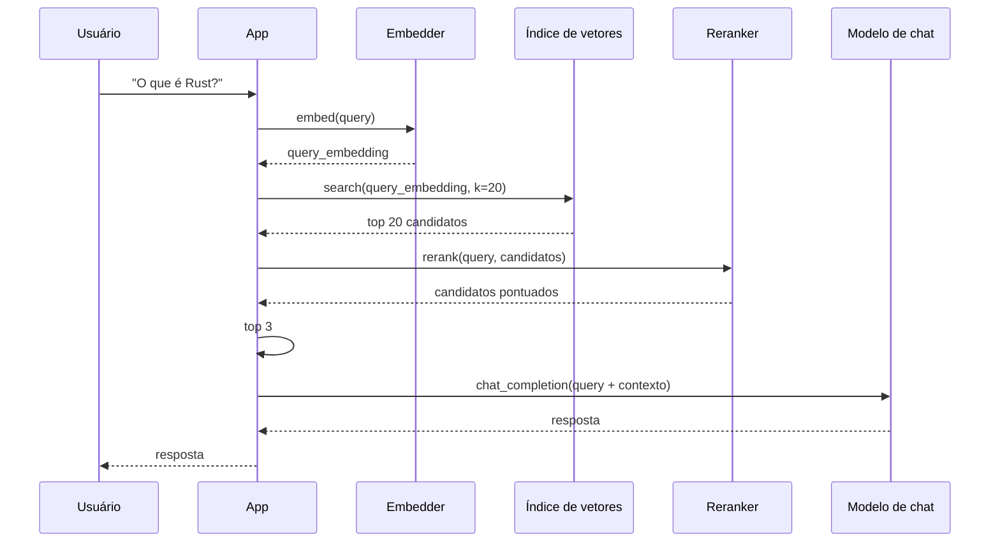

# Construindo um pipeline RAG

**Retrieval-Augmented Generation (RAG)** é o padrão de *recuperar*
documentos relevantes para uma query, depois *gerar* uma resposta
que os cita. Esta receita percorre o pipeline completo: embed →
store → retrieve → re-rank → answer.

## O pipeline



Os cinco passos:

1. **Faça embed da query** com um modelo de embedding.
2. **Recupere o top K** de documentos mais similares de um índice
   de vetores.
3. **Re-ranqueie o top K** com um cross-encoder para maior
   precisão.
4. **Construa um prompt** que inclui a query original e os
   documentos recuperados.
5. **Gere uma resposta** com o modelo de chat.

## Passo 1: embed

```rust
use llama_crab::context::params::PoolingType;
use llama_crab::{Llama, LlamaParams};

let mut embedder = Llama::load(
    LlamaParams::new("bge-small-en-v1.5-q4_k_m.gguf")
        .with_n_ctx(512)
        .with_embeddings(true)
        .with_pooling_type(PoolingType::Cls),
)?;

let query_embedding: Vec<f32> = embedder.embed("What is Rust?", true)?;
```

O argumento `true` normaliza o vetor; com vetores normalizados, o
produto escalar é igual à similaridade cosseno.

## Passo 2: indexe

O índice pode ser em memória (para corpora pequenos), uma
biblioteca HNSW nativa em Rust, ou um banco de dados de vetores.
A API mínima que o índice precisa expor é:

```rust
trait VectorIndex {
    fn insert(&mut self, id: &str, vec: &[f32]);
    fn search(&self, query: &[f32], k: usize) -> Vec<(String, f32)>;
}
```

Para um deploy em produção, use [Qdrant](https://qdrant.tech/),
[pgvector](https://github.com/pgvector/pgvector), ou
[Weaviate](https://weaviate.io/).

## Passo 3: recupere

```rust
let candidates: Vec<(String, f32)> = index.search(&query_embedding, 20);
```

Um K de primeiro estágio típico é 20–100. O re-ranker então reduz
isso para o top 3–5.

## Passo 4: re-ranqueie

O cross-encoder `Llama::rerank` é a ferramenta certa para isso.
Carregue com `PoolingType::Rank`:

```rust
use llama_crab::context::params::PoolingType;
use llama_crab::{Llama, LlamaParams};

let mut reranker = Llama::load(
    LlamaParams::new("bge-reranker-base-q4_k_m.gguf")
        .with_n_ctx(512)
        .with_embeddings(true)
        .with_pooling_type(PoolingType::Rank),
)?;

let documents: Vec<&str> = candidates.iter().map(|(doc, _)| doc.as_str()).collect();
let scores = reranker.rerank("What is Rust?", &documents)?;

// Ordene e pegue o top 3.
let mut reranked: Vec<_> = candidates.iter().zip(scores).collect();
reranked.sort_by(|a, b| b.1.partial_cmp(&a.1).unwrap());
let top: Vec<_> = reranked.into_iter().take(3).collect();
```

## Passo 5: construa o prompt

O formato do prompt depende do template de chat. Um padrão comum:

```rust
use llama_crab::chat::{BuiltinTemplate, ChatMessage, render_builtin};
use llama_crab::Role;

let mut messages = vec![ChatMessage::new(
    Role::System,
    "Você é um assistente prestativo. Use o contexto fornecido para responder a pergunta do usuário. \
     Se a resposta não estiver no contexto, diga que não sabe.",
)];

// Adicione os documentos recuperados como contexto.
let context = top.iter()
    .map(|(doc, _)| doc.as_str())
    .collect::<Vec<_>>()
    .join("\n\n");
messages.push(ChatMessage::new(Role::System, format!("Contexto:\n{context}")));

// Adicione a pergunta do usuário.
messages.push(ChatMessage::new(Role::User, "O que é Rust?"));

// Renderize com um template conhecido.
let prompt = render_builtin(BuiltinTemplate::ChatMl, &messages, &[], true);
```

## Passo 6: gere

```rust
use llama_crab::high_level::chat_completion::create_chat_completion_with;
use llama_crab::chat::BuiltinTemplate;
use llama_crab::chat::ChatMessage;

let mut chat = Llama::load(LlamaParams::new("qwen2.5-7b-instruct-q4_k_m.gguf").with_n_ctx(4096))?;
let response = create_chat_completion_with(
    &mut chat, &messages, BuiltinTemplate::ChatMl, &[], 256,
)?;
println!("{}", response.content);
```

## Juntando tudo



## Considerações de performance

- **Tamanho do índice** — para um corpus de 1M documentos, uma
  instância Qdrant em uma box de 16 GB de RAM pode armazenar ~1M
  vetores de 384 dimensões.
- **Throughput de embedding** — `embed_texts` faz batch da
  inferência, amortizando o custo de carga do modelo. Para 1M
  documentos, espere ~1 hora em uma única A100.
- **Throughput de re-ranking** — `rerank` é uma passada de modelo
  por par. Para 20 candidatos, espere ~50 ms em uma 4090.
- **Latência ponta a ponta** — tipicamente 200–500 ms para o
  pipeline de recuperação mais o tempo de geração do chat.

## Armadilhas comuns

| Armadilha | O que dá errado | Correção |
| --- | --- | --- |
| Tipo de pooling errado | Similaridade é `NaN` ou próxima de zero. | Use `Cls` para BGE / GTE / E5. |
| Índice armazena vetores não normalizados | Produto escalar ≠ similaridade cosseno. | Normalize na hora de inserir. |
| Re-ranker carregado com pooling `Mean` | `rerank` retorna pontuações garbage. | Use pooling `Rank`. |
| Contexto longo demais para o modelo de chat | O modelo trunca ou erra. | Escolha os top 3–5 candidatos, não 20. |
| Modelo cita mas não sintetiza | A resposta é apenas uma colagem. | Adicione um prompt de sistema que peça ao modelo para sintetizar. |

## Por onde ir a partir daqui

- [Guia de embeddings & reranking](../features/embeddings.md) — a
  referência completa.
- [Exemplo de embeddings](../examples/embeddings.md) — um
  programa executável.
- [Exemplo de busca semântica](../examples/embedding-search.md) —
  ranqueamento cosseno sobre um corpus pequeno.
- [Exemplo de reranker](../examples/reranker.md) — demo de
  ranqueamento bi-encoder.
