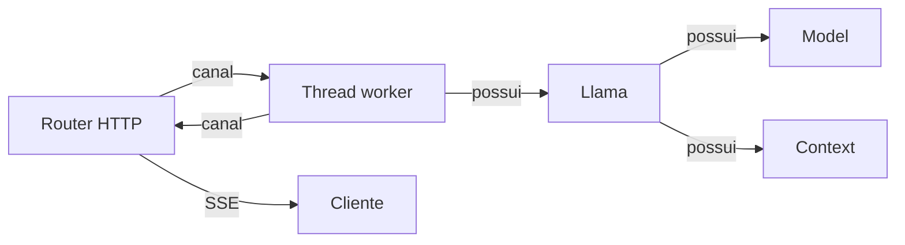

# Servidor

`llama-crab-server` é um binário HTTP fino construído sobre a API
segura do `llama-crab`. Ele mantém a inferência dentro do binding
Rust e usa uma thread worker que possui o modelo e o contexto.

O servidor expõe uma superfície **compatível com OpenAI**
(`/v1/chat/completions`, `/v1/completions`, `/v1/embeddings`,
`/v1/rerank`, `/v1/models`) mais algumas extensões específicas
do llama-crab (`/extras/tokenize`, `/extras/detokenize`). É a
maneira mais fácil de colocar um modelo atrás de um endpoint HTTP
sem escrever um você mesmo.

-   :material-play: __[Executando o servidor](running.md)__

    O comando `cargo run`, as flags de linha de comando, as
    variáveis de ambiente `LLAMA_CRAB_*` e os presets disponíveis.

-   :material-api: __[Referência da API](api.md)__

    Cada rota, o formato da requisição, o formato da resposta e
    os códigos de status. Inclui um exemplo `curl` trabalhado para
    cada uma.

-   :material-broadcast: __[Streaming](streaming.md)__

    Server-Sent Events para requisições `stream: true`. A ordem
    exata dos chunks para chat e completions de texto.

-   :material-code-braces: __[Saída estruturada](structured.md)__

    Os campos de requisição `grammar`, `json_schema` e
    `response_format`, e o pipeline GBNF pelo qual eles passam.

## Forma do runtime

O servidor mantém a inferência do modelo em uma thread worker
dedicada e envia requisições a ela através de canais. `Llama`
possui um modelo nativo e contexto e intencionalmente não é
compartilhado livremente entre threads.

O binário incluído usa este layout:

- Um worker possui uma instância `Llama` e processa requisições
  sequencialmente.
- O router HTTP valida requisições e encaminha jobs de inferência
  para o worker.
- Rotas de streaming encaminham chunks decodificados de volta para
  a tarefa HTTP por um canal.

Você pode executar vários processos do servidor ou estender o crate
com vários workers quando precisar de throughput paralelo.

## Por que um binário separado?

O servidor é intencionalmente um wrapper fino:

- **Configuração** — flags CLI e variáveis de ambiente.
- **Roteamento HTTP** — parsing de requisições, formatação de
  respostas.
- **Ciclo de vida do worker** — startup, shutdown, tratamento de
  erros.
- **Transporte de streaming** — Server-Sent Events.
- **Erros** — converte `LlamaError` em códigos de status HTTP no
  estilo OpenAI.

O comportamento de inferência permanece em `llama-crab` para que
os usuários de CLI, biblioteca e servidor exercitem a mesma
implementação. Se você fizer fork do servidor para uma integração
customizada, a única lógica que precisa ser mantida em sincronia
é a camada HTTP — o código do modelo permanece o mesmo.

## Por onde ir a partir daqui

- [Executando o servidor](running.md) — o comando de boot e as
  flags de linha de comando.
- [Referência da API](api.md) — cada rota e seus parâmetros.
- [Streaming](streaming.md) — o contrato SSE.
