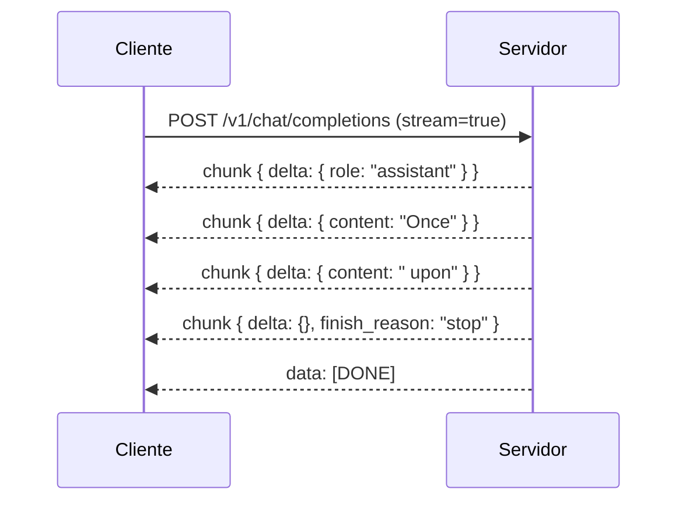

# Streaming

Defina `"stream": true` em requisições de completion ou chat para
receber Server-Sent Events. Esta página documenta a ordem exata
dos chunks, os campos em cada chunk e os frames terminais.

## Básico de Server-Sent Events

O servidor emite um evento por linha, no formato SSE padrão:

```
data: {"id":"...","object":"text_completion",...}

data: {"id":"...","object":"text_completion",...}

data: [DONE]
```

Uma linha em branco separa eventos. O prefixo `data:` é
obrigatório; clientes usam [`EventSource`](https://developer.mozilla.org/en-US/docs/Web/API/EventSource)
ou qualquer biblioteca SSE para ler o stream.

## Stream de completion de texto

`POST /v1/completions` com `"stream": true` emite chunks com
`choices[].text` carregando o texto incremental:

```bash
curl -N http://127.0.0.1:8080/v1/completions \
  -H 'content-type: application/json' \
  -d '{"prompt":"Once upon a time","max_tokens":32,"stream":true}'
```

```
data: {"id":"cmpl-...","object":"text_completion","choices":[{"text":" Once","index":0}]}

data: {"id":"cmpl-...","object":"text_completion","choices":[{"text":" upon","index":0}]}

data: {"id":"cmpl-...","object":"text_completion","choices":[{"text":" a","index":0}]}

data: [DONE]
```

Defina `"logprobs": true` para também receber por token `tokens`,
`text_offset`, `token_logprobs` e `top_logprobs` em cada chunk.

## Contrato de stream de chat

`POST /v1/chat/completions` com `"stream": true` emite chunks nesta
ordem exata:

1. Um primeiro chunk com `choices[0].delta` contendo
   `{"role": "assistant"}` e sem conteúdo. Este frame é enviado
   apenas depois que o servidor terminou de validar `options`, o
   prompt de chat e o sampler, então uma requisição malformada
   nunca produz um frame de role válido.
2. Zero ou mais chunks de conteúdo com `choices[0].delta.content`
   definido como o texto decodificado nesse passo e
   `choices[0].delta.role` omitido.
3. Um chunk terminal com `choices[0].delta` igual a `{}` e
   `choices[0].finish_reason` definido como `"stop"`, `"length"`,
   ou `"tool_calls"`.
4. Um frame SSE final `data: [DONE]`.



Se a validação falha antes da geração, o stream termina com um
evento SSE de `error` carregando a mensagem de validação e **nenhum**
frame de role é emitido.

### Exemplo `curl` trabalhado

```bash
curl -N http://127.0.0.1:8080/v1/chat/completions \
  -H 'content-type: application/json' \
  -d '{
    "messages": [{"role":"user","content":"Hello!"}],
    "max_tokens": 16,
    "stream": true
  }'
```

A saída se parece com:

```
data: {"id":"chatcmpl-...","object":"chat.completion.chunk","choices":[{"index":0,"delta":{"role":"assistant"}}]}

data: {"id":"chatcmpl-...","object":"chat.completion.chunk","choices":[{"index":0,"delta":{"content":"Hi"}}]}

data: {"id":"chatcmpl-...","object":"chat.completion.chunk","choices":[{"index":0,"delta":{"content":" there"}}]}

data: {"id":"chatcmpl-...","object":"chat.completion.chunk","choices":[{"index":0,"delta":{},"finish_reason":"stop"}]}

data: [DONE]
```

## Streaming com tools

Quando o modelo emite uma tool call, os chunks carregam
`delta.tool_calls` com os argumentos incrementais da função. O
chunk terminal tem `finish_reason: "tool_calls"` em vez de
`"stop"`.

```bash
curl -N http://127.0.0.1:8080/v1/chat/completions \
  -H 'content-type: application/json' \
  -d '{
    "messages": [{"role":"user","content":"Weather in Tokyo?"}],
    "tools": [{
      "type": "function",
      "function": {
        "name": "get_weather",
        "description": "Get weather for a city",
        "parameters": {
          "type": "object",
          "properties": { "city": { "type": "string" } },
          "required": ["city"]
        }
      }
    }],
    "tool_choice": "auto",
    "stream": true
  }'
```

```
data: {"choices":[{"delta":{"role":"assistant"}}]}

data: {"choices":[{"delta":{"tool_calls":[{"index":0,"id":"call_weather","type":"function","function":{"name":"get_weather","arguments":""}}]}}]}

data: {"choices":[{"delta":{"tool_calls":[{"index":0,"function":{"arguments":"{\""}}]}}]}

data: {"choices":[{"delta":{"tool_calls":[{"index":0,"function":{"arguments":"city"}}]}}]}

data: {"choices":[{"delta":{"tool_calls":[{"index":0,"function":{"arguments":"\":\\\"Tokyo\\\"}"}}]}}]}

data: {"choices":[{"delta":{},"finish_reason":"tool_calls"}]}

data: [DONE]
```

## Erros durante o streaming

Se o modelo errar no meio da geração (ex. um `LlamaError`), o
stream termina com um evento SSE de `error`:

```
event: error
data: {"message": "context overflow", "type": "server_error"}
```

O código de status HTTP na resposta ainda é `200` (SSE não carrega
um código de status por evento); o cliente deve ler o tipo do
evento para detectar o erro.

## Bibliotecas cliente

Os chunks correspondem ao formato de streaming da OpenAI, então
qualquer biblioteca cliente OpenAI funciona depois que você
apontá-la para `http://127.0.0.1:8080/v1`:

=== "Python (openai)"

    ```python
    from openai import OpenAI

    client = OpenAI(base_url="http://127.0.0.1:8080/v1", api_key="not-needed")

    stream = client.chat.completions.create(
        model="local-model",
        messages=[{"role": "user", "content": "Hello!"}],
        stream=True,
    )
    for chunk in stream:
        delta = chunk.choices[0].delta
        if delta.content:
            print(delta.content, end="", flush=True)
    ```

=== "TypeScript (openai)"

    ```typescript
    import OpenAI from "openai";

    const client = new OpenAI({
        baseURL: "http://127.0.0.1:8080/v1",
        apiKey: "not-needed",
    });

    const stream = await client.chat.completions.create({
        model: "local-model",
        messages: [{ role: "user", content: "Hello!" }],
        stream: true,
    });

    for await (const chunk of stream) {
        const content = chunk.choices[0]?.delta?.content ?? "";
        process.stdout.write(content);
    }
    ```

## Por onde ir a partir daqui

- [Referência da API](api.md) — cada campo de requisição.
- [Saída estruturada](structured.md) — combinando `stream: true`
  com `response_format`.
- [Executando o servidor](running.md) — flags de boot e presets.
